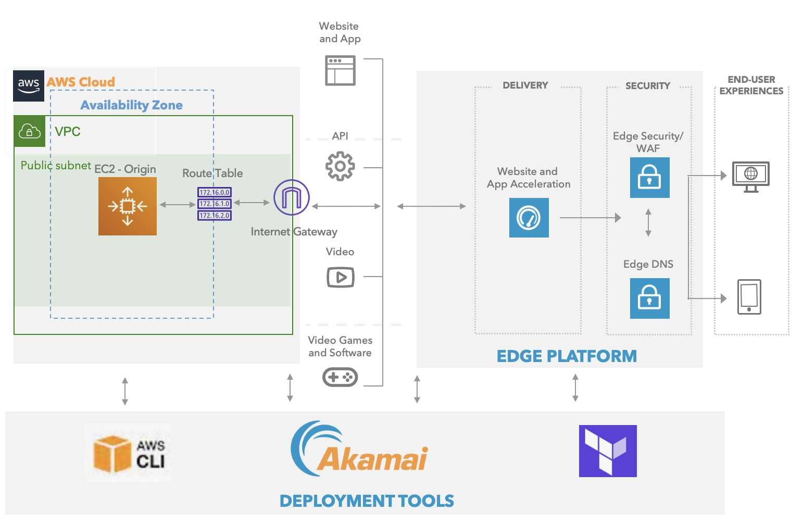

# aws-akamai

 This repo has been provisioned to store terraform examples for building a website on AWS. Site will then be delivered securely using Akamai CDN and Security platform

Below is the high level architecture for end goal.

 **Pre-requisites**:- This post assume that you have fair bit of understanding working with terraform, Akamai api's, Akamai ecosystem, AWS ecosystem and AWS cli. Below are the important links for getting started with 
 1. Akamai API - https://developer.akamai.com/getting-started/edgegrid
 2. AWS CLI - https://docs.aws.amazon.com/cli/latest/userguide/cli-chap-welcome.html
 3. About Terraform - https://www.terraform.io/
 4. Terraform - Akamai provider https://registry.terraform.io/providers/akamai/akamai/latest/docs
 5. Terraform - AWS provider https://registry.terraform.io/providers/hashicorp/aws/latest

**Detailed blogpost on how to provision a website on AWS and delivery it securely via. Akamai Edge Platform**

https://deepakjd2004.medium.com/cloud-agnostic-secure-delivery-of-a-website-on-akamai-edge-platform-using-terraform-part-i-e2ce226231ed

https://medium.com/@deepakjd2004/cloud-agnostic-secure-delivery-of-a-website-on-akamai-edge-platform-using-terraform-part-ii-fd72f43bb0e8
